<h1 align="center"></h1>

<h3>Hi There 👋 I am ElvisLo (´▽｀)</h3>
<h3>🇹🇼 A student from Taiwan</h3>
<h3>🏫 CSU-MIS</h3>
<h3>📖 Learning about Python , Java , Vue , PostgreSQL </h3>
<h3>🎮 Rhythm Gamer </h3>
<h3><a href="mailto:me@elvislo.tw" >
  ✉️ me@elvislo.tw
</a></h3>
<h3><a href="https://www.elvislo.tw">🐶 My Blog</a></h3>

---

## 📊 GitHub Stats

  
  

## 📌 Pinned Projects

  
  
   
  
  

